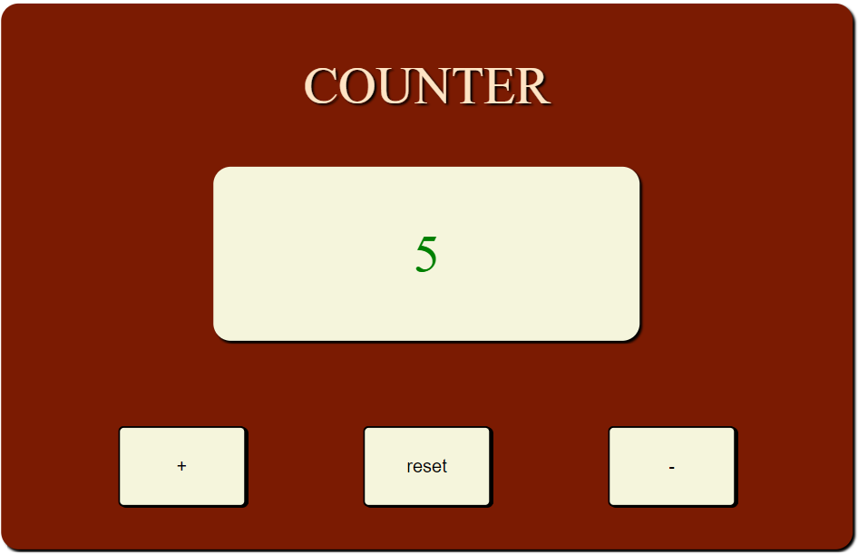
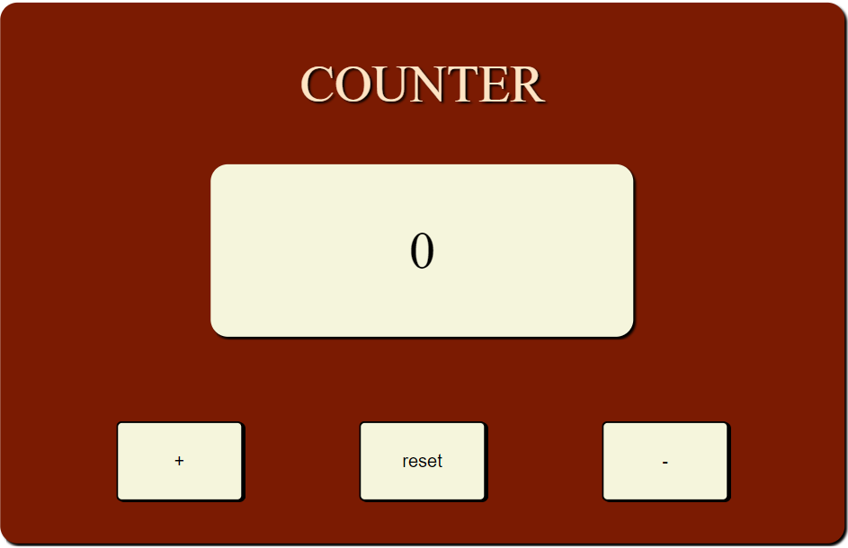
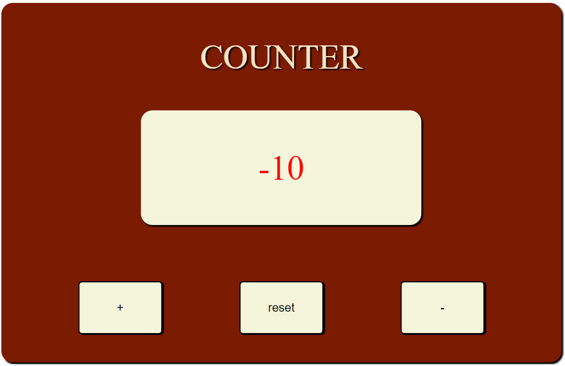

# Counter 

This app is intended to be used as a simple counter 

## Description 

we have a simple interface, with three buttons you can use. The first to increase, the second to reset and the last to decrease. the color of the reported value will change according to the sign, green if it has a positive sign, red if it has a negative sign and black if the value is zero.

## Usage 

Using the app is simple, we have three buttons to interface with.
* increase +
* decrease -
* back to zero 'reset' 

## Link 

Counter : https://alessandrosoriente.github.io/Counter/Index.html

## Demo 

